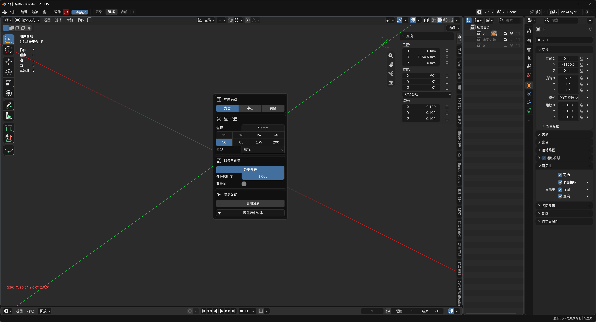

# 快速设置相机 (Quick Camera Setup)

Blender 的相机参数散落各处：焦距在镜头栏、光圈和焦点在景深面板、构图辅助线藏在显示选项里、背景图透明度还要进外框设置——构图调机位时来回跳转，效率很低。

本插件把相机设置集中到一个弹窗：**物体模式选中相机按 `D`**，焦距、光圈、景深、构图辅助线、外框背景图一屏搞定；同样的界面也集成在 3D 视图 `N` 面板中。

## 功能总览

| 模块 | 内容 |
| --- | --- |
| 镜头设置 | 焦距 + 8 档常用焦距预设（12 ～ 200mm，当前档位高亮），透视 / 正交切换 |
| 景深设置 | 一键启用景深；**聚焦选中物体**（同时选中相机与目标物体，焦点自动绑定）；11 档光圈预设（f/1.2 ～ f/22） |
| 构图辅助 | 三分线（九宫）、中心点、黄金分割构图线开关 |
| 取景与背景 | 相机外框（Passepartout）及透明度、背景图逐层透明度控制 |
| 视图控制 | 相机对齐当前视图、一键进入相机视图 |

所有操作支持 Blender 撤销（Ctrl+Z）。

## 快捷键与入口

- **`D`**（物体模式，选中相机）：打开相机设置弹窗，点击空白处关闭
- **N 面板**：3D 视图 → `N` → 快速设置相机，功能与弹窗一致，并含模块显示开关

> 与"快速设置灯光"插件兼容：两者默认使用相同的 `D` 键，Blender 会按当前选中对象（相机或灯光）自动分派，互不冲突。

## 自定义

- **模块显示**：四个模块可独立显示 / 隐藏（N 面板顶部眼睛图标，按场景存储）
- **弹窗宽度**：180 ～ 500 可调

## 安装

1. 在 [Releases](../../releases) 页面下载 `quick_camera_setup-x.x.x.zip`
2. Blender → 编辑 → 偏好设置 → 获取扩展（Get Extensions）
3. 点击右上角下拉箭头 → 从磁盘安装（Install from Disk），选择 zip 并启用

> Blender 3.0～4.1（无扩展系统）：下载仓库中的 `__init__.py`，改名为 `quick_camera_setup.py`，通过偏好设置 → 插件 → 安装（旧式插件）安装。

## 兼容性

- 代码支持 Blender 3.0 及以上
- 扩展方式安装需 Blender 4.2+

## 许可证

[GPL-3.0-or-later](LICENSE)

## 同系列插件 · More by wen-yifeng

**相机 / Camera** — [camera_list](https://github.com/wen-yifeng/camera_list)（F10 切相机）· [quick_camera_setup](https://github.com/wen-yifeng/quick_camera_setup)（D 键相机设置）

**灯光 / Lighting** — [quick_light_setup](https://github.com/wen-yifeng/quick_light_setup)（D 键灯光设置）· [smart_light_size](https://github.com/wen-yifeng/smart_light_size)（拖拽调灯大小）

**视图 / Viewport** — [view_reset](https://github.com/wen-yifeng/view_reset)（Alt+R 一键复位）· [view_rotate_mode_switch](https://github.com/wen-yifeng/view_rotate_mode_switch)（轨迹球旋转）· [view_alerts_hud](https://github.com/wen-yifeng/view_alerts_hud)（Shift+F2 状态 HUD）

**工作流 / Workflow** — [outliner_smart_sync](https://github.com/wen-yifeng/outliner_smart_sync)（大纲批量显隐）· [editor_split](https://github.com/wen-yifeng/editor_split)（一键分屏）· [npanel_focus](https://github.com/wen-yifeng/npanel_focus)（Q 键 N 面板）· [duplicate_to_collection](https://github.com/wen-yifeng/duplicate_to_collection)（复制到集合）· [object_mode_uv_unwrap](https://github.com/wen-yifeng/object_mode_uv_unwrap)（物体模式 UV）· [render_auto_save](https://github.com/wen-yifeng/render_auto_save)（F12 自动存图）

**预设 / Presets** — [pme_preset](https://github.com/wen-yifeng/pme_preset)（Pie Menu Editor 80 个饼菜单）

好用的话点个 Star ⭐ · A star is appreciated if it helps you.
